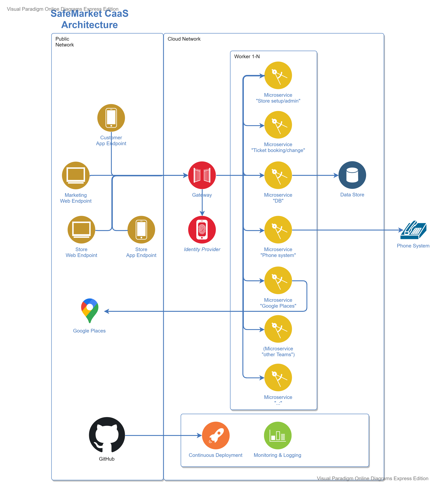

# Gesamtarchitektur mit Container-as-a-Service

## Überblick

## Container-as-a-Service
- Aufsplitten der einzelnen Funktionalität in Microservices
    + Vorteile:
        + individuell skalierbar
        + modular
        + flexibel
        + einfachere Verständlichkeit, da Funktionen eigenständig
        + "unabhängige" Entwicklung in kleinen Teams
        + Wartbarkeit von einzelnen Funktionen
        + lokale Entwicklung von Services in Container möglich
    - Nachteile:
        - "komplexere" Architektur
        - jetziges "SafeMarket"-Backend zu Microservices refactoren
        - aufwändiger als FaaS

- Automatisiertes Deployment via Pipeline
- Kostenstruktur langfristig klar berechenbar anhand von benötigten Workern/ Nodes
- Belibiger Cloud Anbieter möglich
- Vorgefertigte Services schnell integrierbar

## Externe Datenquellen

- Telefonsystem
    - später drum kümmern
    - Requests an CaaS Microservice, um Daten zu holen bzw. zu persistieren nach dem Anruf
- Maps API
    - Eigener Microservice zur Kommunikation
    - Um Geschäfte in der Nähe zu finden
    - Um Geschäfte zu validieren
    - Was ist mit Geschäften die nicht eingetragen sind?
- Weitere externe Datenquellen (andere Teams / Informationen über Stores)
    - Hinzufügen entsprechender Microservices

## Fontends

- Endkunden App
    - jetzige "SafeMarket"-App weiterentwickeln
    - Flutter
- Endkunden Website (Out-of-Scope)
- Store Website (Neuentwicklung)
- Marketing Website
    - gohugo als Static Site Generator
- Store App
    - Neu Angular und phoneGap
- Websites sind alle statisch => brauchen nur einfachen Webserver
    - relativ günstig

## Continuous Integration/Deployment

- Git als VCS
- CI/CD von der Cloud nutzen, die wir am Ende nutzen (für einfache Integration den Functions)
- ziemlich trivial
    - für Microservices =>  Kompilieren -> Test -> deploy
    - für Website => Test -> Kompilieren -> deploy
    - für Apps => Test -> Kompilieren -> In AppStore hochladen
- Swagger für Mocks + Dokumentation aller API-Calls