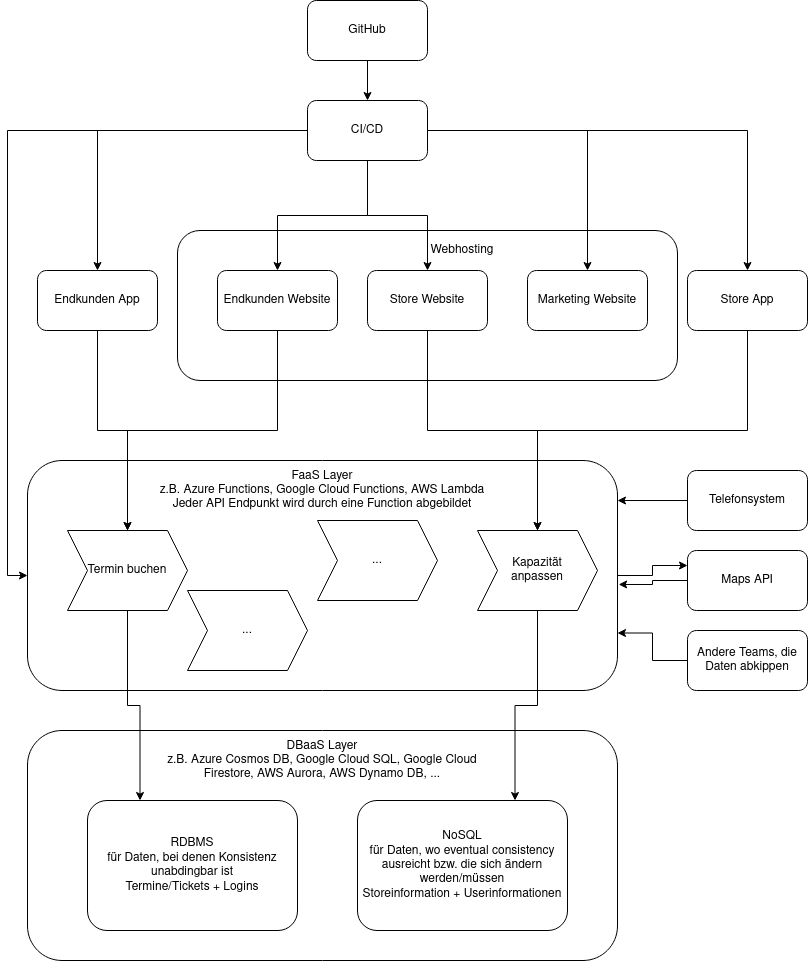

# Gesamtarchitektur mit Functions-as-a-Service

## Überblick

## Database-as-a-Service

- Dient der Speicherung aller Daten
- Trennung zwischen relationalen Datenbanken und NoSQL
    - relationale Datenbanken:
        - werden verwendet bei Daten die unbedingt konsistent seien müssen
        - Termine/Tickets/Slot: Es darf keine Überbuchung stattfinden
        - Trotzdem muss auf "Performance" geachtet werden (weiter unten mehr)
        - Userdaten: E-Mail + Passwort + UserID
        - Storedaten: StoreID + Owner(UserID) + Name?
        - sowohl für Termine (Startzeitpunkt, Dauer, StoreID, UserID) als auch Userdaten Schema bekannt und unterliegt wahrscheinlich keine Änderung
    - NoSQL:
        - sehr flexibel
        - habe hier hauptsächlich in Richtung Dokumentendatenbanken gedacht
        - weitere Nutzerinformationen als Dokument, auffindbar per UserID
        - weitere Storeinformationen als Dokument, auffindbar per StoreID
        - vielleicht Daten von anderen Teams
        - Key-Value-Store für das Session-Mangement bei authentifizierten Nutzern
    - Konsitenz der StoreIDs und UserIDs muss durch die Functions gewährleisten werden (am Besten beim Anlegen der Entitäten)
    - schwierige ORM-Integration
- As-a-Service
    - wahrscheinlich teurer als selbst machen
        - aber man zahlt wiederum nur für das was man braucht
    - wir müssen keine Infrastruktur managen
    - für Security und Backups ist gesorgt
    - auf "Knopfdruck" bereit und integrierbar
- Termin/Slot/Ticket Performance:
    - Das folgende Termin/Ticket/Slot ist zwar schön, wird aber bei einigen konkurrierenden Write/Read-Vorgänge sehr langsam:
        - UserID als Fremdschlüssel + StoreID als Fremdschlüssel + Startzeitpunkt + Dauer
        - würde alle vergangen und zukünftigen Termine enthalten
        - 1 Mio User * 1000 Stores * 10 Termine = 10 Millarden Zeilen
        - Writes müssten wegen Konsistenz mehr oder weniger die ganze Tabelle locken
    - Besser: eine Termin Table pro Store
    - vielleicht auch historisch Daten in anderen Speicher überführen

## Functions-as-a-service

- Ort für die Business Logik
- sammelt Daten aus dem DBaas-Layer
- speichert Daten im DBaaS-Layer
- jede HTTP API-Endpunkt wird eine Function
    - sehr modular
    - einfach zu warten
    - flexibel, weitere Endpunkte können einfach hinzugefügt werden
- kein "Deployment" erforderlich => einfach Code an der richtigen Stelle abkippen
- einfaches Updaten => Code austauschen
- automatische Skalierung
- wir müssen keine Infrastruktur managen
- viele unterstützte Programmiersprachen
    - viele können am Backend arbeiten
    - würde es aber wahrscheinlich auf C# + Python beschränken (zwecks Wartbarkeit)
    - fördert auch Integration von Helfern, die nur mal schnell was coden wollen :D
    - jetziges "SafeMarket"-Backend zu Functions refactoren
- man zahlt nur für das was man braucht
    - erstaunlich günstig, da wir eher kleine und kurze Workloads haben 
    - [Beispiel Google Cloud Functions](https://cloud.google.com/functions/pricing#simple_background_function)

## Externe Datenquellen

- Telefonsystem
    - später drum kümmern
    - macht HTTP-Aufrufe an das FaaS-Layer, um Daten zu holen bzw. zu persistieren nach dem Anruf
- Maps API
    - Um Geschäfte in der Nähe zu finden
    - Um Geschäfte zu validieren
    - Was ist mit Geschäften die nicht eingetragen sind?
    - Kommunikation per HTTP mit FaaS Layer
- Weitere externe Datenquellen (andere Teams / Informationen über Stores)
    - Kommunikation per HTTP mit FaaS Layer

## Fontends

- Endkunden App
    - jetzige "SafeMarket"-App weiterentwickeln
    - Flutter
- Endkunden Website
    - erstmal Out-of-Scope
    - könnte später basierend auf dem "Queued"-Frontend basieren
- Store Website
    - bleibt, wenn es mit Vue weitergeht
- Marketing Website
    - gohugo als Static Site Generator
- Store App
    - Neu mit Flutter oder als Progressive Web App
- Websites sind alle statisch => brauchen nur einfachen Webserver
    - relativ günstig

## Continuous Integration/Deployment

- Git als VCS
- CI/CD von der Cloud nutzen, die wir am Ende nutzen (für einfache Integration den Functions)
- ziemlich trivial
    - für Functions => Test -> An die richtige Stelle kopieren
    - für Website => Test -> Kompilieren -> An die richtige Stelle kopieren
    - für Apps => Test -> Kompilieren -> In AppStore hochladen
- Swagger für Mocks + Dokumentation aller API-Calls